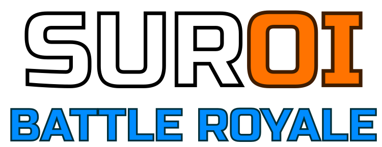

<div align="center">
    
    <hr />
</div>

<div align="center">
    
    
    
    
    
    
    
</div>

# SuroiBot
SuroiBot serves as the moderation, gamification, and utilities bot for the [Suroi](https://discord.gg/suroi) Discord server.

## Prerequisites
 * [bun](https://bun.sh)
 * [Drizzle ORM](https://orm.drizzle.team)
 * [PostgreSQL](https://www.postgresql.org)
 * [Git](https://git-scm.com)

## Installation
To install dependencies for this project, open a command line interface at the directory of the cloned repository, and run
```sh
bun install
```

This will create a `node_modules` directory in that of your project and link the packages there.

## Setup
Testing the application using a database on your own machine will require a localhost database setup:

1. Copy the contents of `.env.example` to `.env` in the root directory of the repository.
2. Replace the contents of each key with personalized values.

### Development
To run the bot locally in development, run
```sh
bun dev
```

### Production
To build for production, open up a terminal window in the root directory of the project and run
```sh
bun run build
```

To execute a production build, run
```sh
bun start
```
